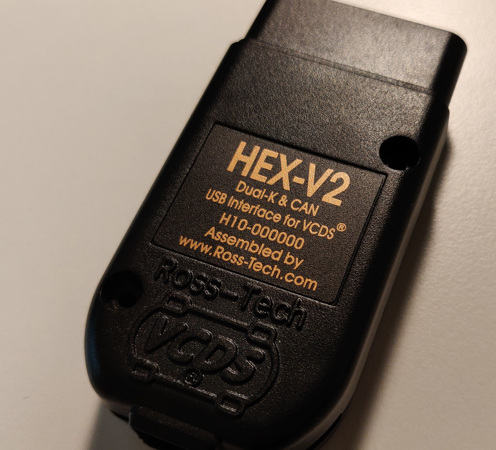
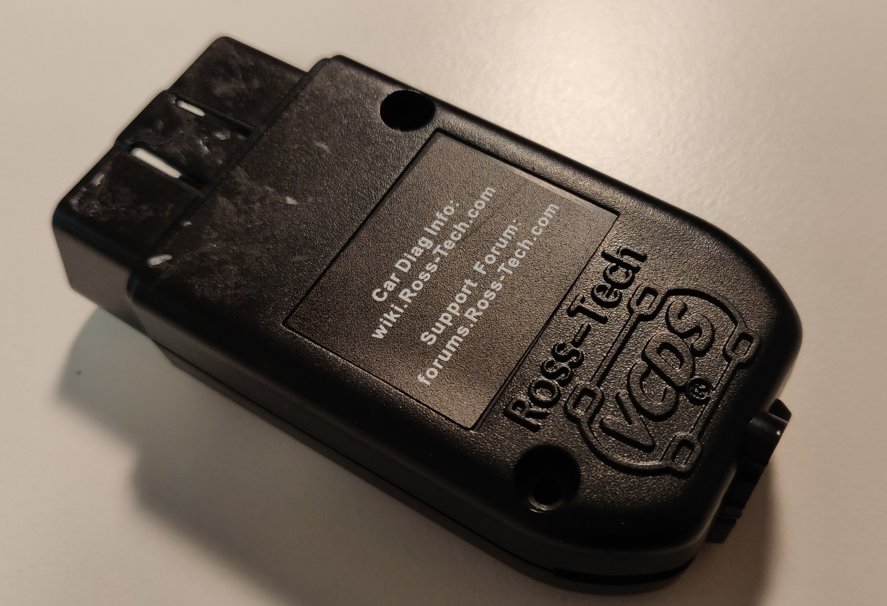
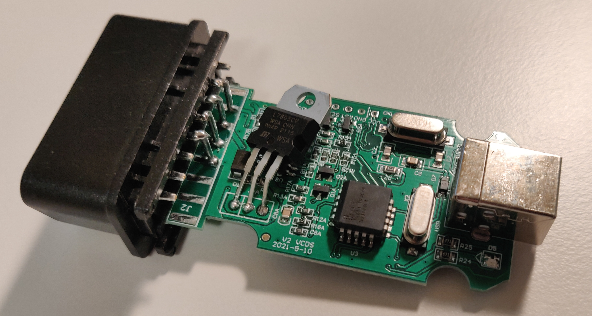
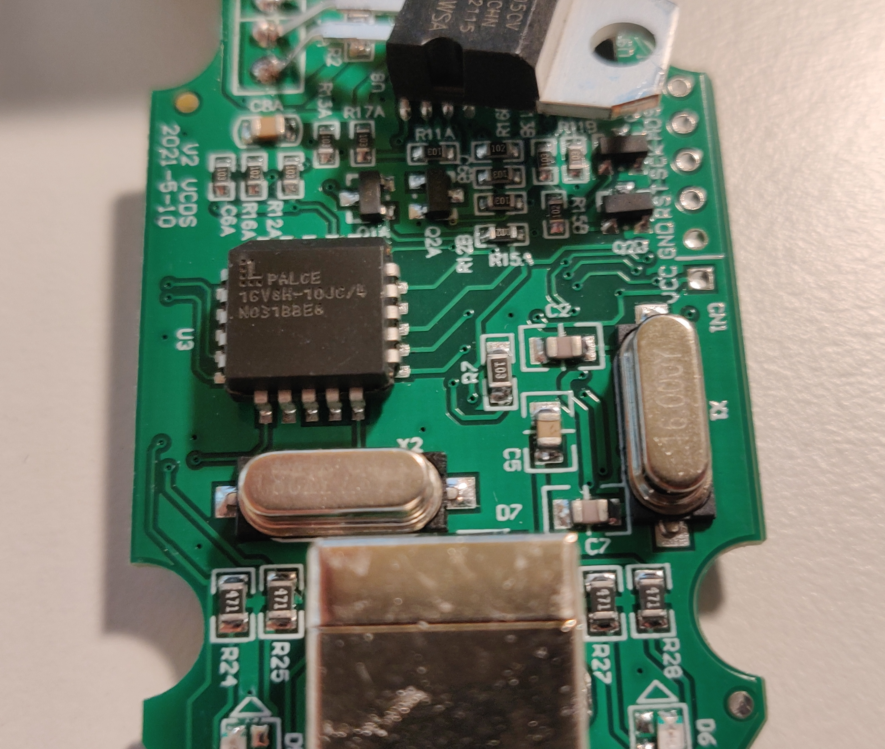
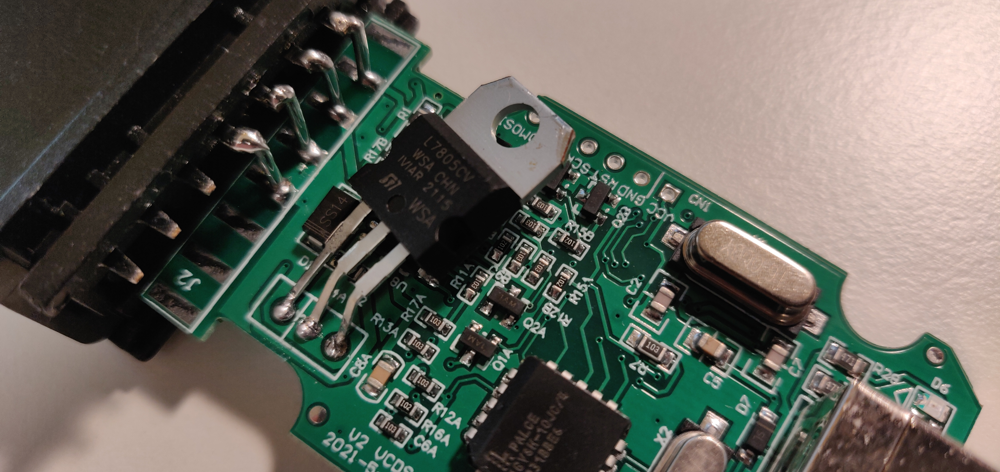
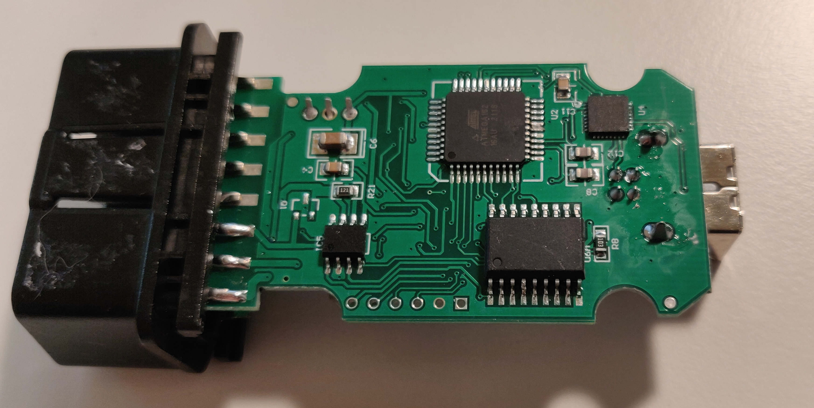
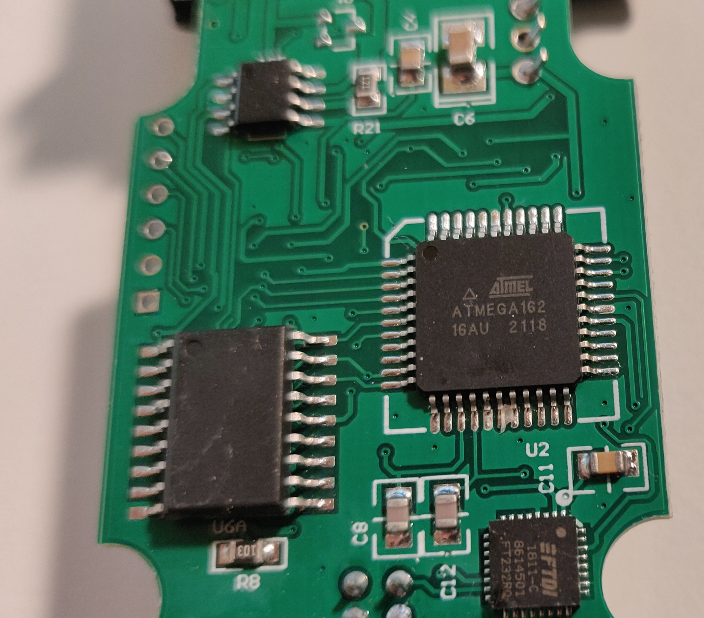
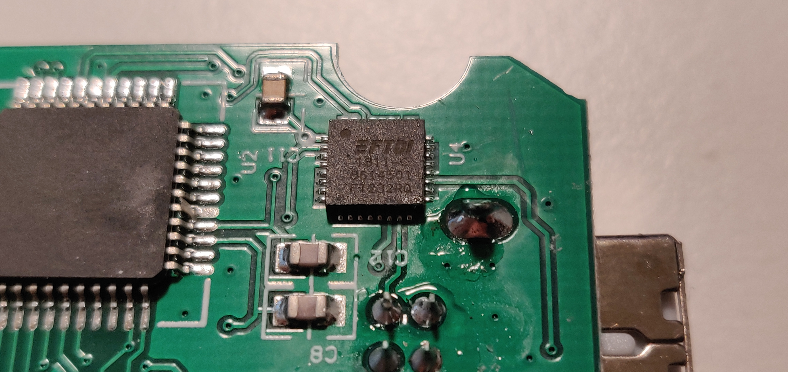
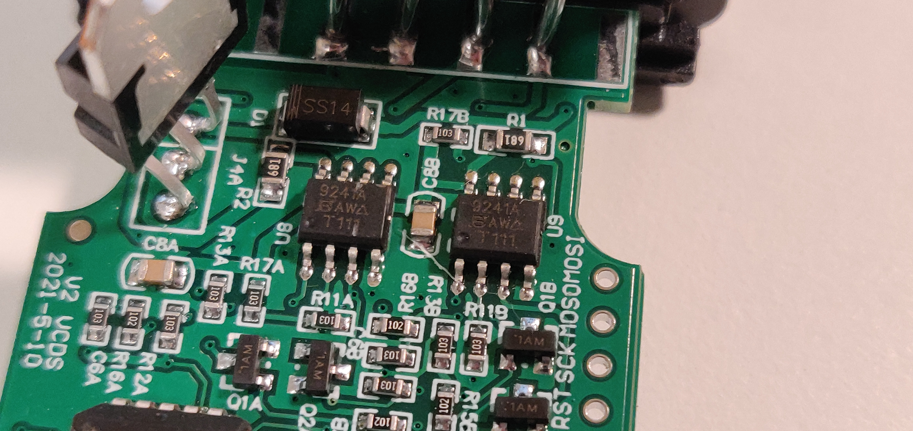

# HEX-V2 VCDS Interface Clone Teardown
This is a 30€ Aliexpress clone of the [Ross-Tech HEX-V2](https://store.ross-tech.com/shop/vchv2_ent/) VCDS Interface.

## Information

| Information      | Description          |
|:-----------------|:---------------------|
| Manufacturer     | Ross-Tech (original) |
| Model No.        | HEX-V2               |
| Hardware Version | V2 VCDS 2021-5-10    |

## Components

| Component           | Description                                   |
|:--------------------|:----------------------------------------------|
| `Atmega162`         | Mikrocontroller                               |
| `FT232RQ`           | USB Full Speed to Serial UART IC              |
| `PALCE16V8H-10JC/4` | Universal Programmable Array Logic            |
| `SI9241A`           | Bus Transceiver                               |
| `MCP2515`           | Stand-Alone CAN Controller with SPI Interface |

## Pictures

